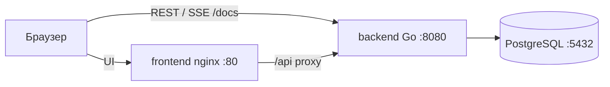

# Duekeep — архитектура и план разработки

Документ написан **до кода**. Источник требований: [FUNCTIONAL.md](FUNCTIONAL.md).

Решения, зафиксированные 2026-08-21:

- все дефолты из открытых вопросов `FUNCTIONAL.md` приняты;
- типы записей — справочник `item_kinds`, специфика типа — `items.attrs JSONB`;
- общие поля срока и денег остаются колонками;
- авторизация — JWT access + refresh (ротация), не cookie-сессия;
- данные в v1 ещё общие, протокол токенов сразу готов к многопользовательскому развитию;
- клиент — PWA + Web Push.

---

## 1. Цель системы

Duekeep отвечает на вопрос: *что истечёт в ближайшие дни и сколько это стоит*.

v1: одна инсталляция, общий набор данных (семья / home lab). Пользователи отличаются ролью, не владением записями.

Дальше продукт идёт в многопользовательский режим (несколько клиентов, свои данные). Поэтому auth сразу **JWT + refresh**, а не серверная cookie-сессия: токены не привязаны к одному браузеру, в claims есть `sub` и `role`. Владение записями после v1 — `owner_id` = `sub` ([Sprint 7](docs/sprint-7-plan.md)), не `org_id`.

---

## 2. Ограничения

| Ограничение | Решение |
|---|---|
| Запуск одной командой | `docker compose up` = PostgreSQL + backend + frontend |
| Проверка API | живой OpenAPI UI на `/docs` |
| Учебный объём v1 | без почты, вложений, оплаты; изоляция данных по org — следующий этап, не этот релиз |
| История git | код и инфраструктура идут отдельными коммитами по спринтам в `docs/` |
| Время | инжектируемые часы (`clock`), чтобы тесты и seed не зависели от «сегодня» |

---

## 3. Стек

| Слой | Выбор | Зачем |
|---|---|---|
| Backend | Go 1.25, `net/http`, [chi](https://github.com/go-chi/chi) | зафиксированная версия языка; мало магии, удобно тестировать хендлеры |
| БД | PostgreSQL 16, [pgx/v5](https://github.com/jackc/pgx) | JSONB, массивы тегов, иерархия категорий |
| Миграции | [goose](https://github.com/pressly/goose) | SQL-файлы в репозитории, прогон при старте |
| Пароли | bcrypt | достаточно для демо |
| JWT | [golang-jwt](https://github.com/golang-jwt/jwt), HS256 | access 15 мин; refresh в БД, 14 дней, ротация |
| Web Push | VAPID, [webpush-go](https://github.com/SherClockHolmes/webpush-go) | пуши в ОС, когда вкладка закрыта |
| Логи | `log/slog` JSON в stdout | читается из `docker compose logs` |
| OpenAPI | `backend/openapi.yaml` + Swagger UI | контракт рядом с кодом, без кодогенерации как обязательного шага |
| Frontend | React 18, TypeScript, Vite, PWA (Workbox) | SPA + установка на домашний экран |
| Маршруты UI | React Router | экраны из функционала |
| Данные UI | TanStack Query | список, дашборд, инвалидация после мутаций |
| Формы | react-hook-form + zod | валидация на клиенте |
| Графики | Recharts | bar / pie для дашборда |
| Стили | Tailwind CSS | адаптив без тяжёлого UI-kit |
| CI | GitHub Actions | `golangci-lint` + `go test`, ESLint + `tsc --noEmit` |

Альтернативы, которые сознательно не берём: ORM (GORM) — для этого объёма лишний слой; WebSocket — SSE проще для односторонних уведомлений.

---

## 4. Контекст и контейнеры



- Преподаватель открывает UI на `http://localhost` и Swagger на `http://localhost:8080/docs`.
- Nginx отдаёт статику SPA и проксирует `/api` на backend — один origin для повседневной работы.
- Backend также слушает `:8080` снаружи: так проще проверить API без фронта.
- Compose лежит в `deploy/` (как в my-chat). Из корня `docker compose up` — `include` локального файла, проект `duekeep`.
- Локальная Postgres с хоста: `localhost:15432` (хостовый 5432 занят). Внутри сети контейнеров backend ходит на `db:5432`.
- Прод: секреты только в корневом `.env` (не в git), Postgres наружу не публикуем.

### Процессы backend

Один бинарь, две петли:

1. HTTP-сервер: REST, OpenAPI, SSE.
2. Тикер статусов (`TICKER_EVERY`, по умолчанию 12 ч; Tick при старте): пересчёт `active` / `expiring` / `expired` по календарному дню UTC, уведомления и SSE только владельцу.

Часы и тикер выключаются в тестах через интерфейс `Clock`.

---

## 5. Структура репозитория

```text
expiry-calendar/
  ARCHITECTURE.md
  FUNCTIONAL.md
  REPORT.md
  README.md
  Taskfile.yml
  docker-compose.yml          # include deploy/local, name: duekeep
  .env.example                # шаблон прода; живой .env не коммитить
  deploy/
    local/docker-compose.local.yml
    test/docker-compose.test.yml
    prod/                     # nginx, certbot, init-ssl.sh
  .github/workflows/ci.yml
  backend/
    cmd/server/main.go
    internal/
      handler/       # HTTP: decode/encode, коды, вызов service
      service/       # сценарии и инварианты
      repository/    # SQL через pgx
      model/         # сущности и DTO
      middleware/    # Bearer JWT, request_id, ACL
      clock/         # инжектируемые часы
      sse/           # hub клиентов
      seed/
      db/            # пул, транзакции
    migrations/
    openapi.yaml
    testdata/
  frontend/
    src/
      pages/
      components/
      api/
      hooks/
    nginx.conf
```

### 5.1. Слои: handler → service → repository

Берём классическую нарезку, не пакеты «по домену».

```text
handler  →  service  →  repository  →  PostgreSQL
                ↓
         audit, sse, clock
```

| Слой | Делает | Не делает |
|---|---|---|
| **handler** | JSON, query/path, статус HTTP, маппинг ошибки service → 4xx/5xx | SQL, расчёт статуса, проверка `attrs` |
| **service** | сценарий: валидация, инварианты, транзакция, аудит, публикация SSE | `http.ResponseWriter`, сырой SQL |
| **repository** | запросы pgx, сканирование строк | бизнес-правила, знание HTTP |
| **model** | структуры `Item`, `Kind`, фильтры, ошибки домена | импорт `net/http` и pgx |

Правила зависимостей: handler знает service, service знает интерфейсы repository, реализация repository живёт в `internal/repository`. Вниз по слоям можно, вверх — нет.

Интерфейсы объявляем **в service** (потребитель), реализации — в `repository`. В тестах service подменяем fake-репозиторием; handler тестируем с fake-service.

Почему не «хендлер сразу в БД» и не пакеты `item/` / `kind/`:

- учебный проект и демо: слои сразу видны проверяющему;
- тикер статусов, продление, импорт CSV, аудит и права — это сценарии, им нужно одно место, не размазанный SQL по хендлерам;
- service тестируется без HTTP и без Postgres; repository — отдельно на тестовой БД;
- доменов много (items, kinds, categories, renewals, notifications, dashboard, csv), но правила общие. Слои не заставляют копировать `audit`/`tx` в каждый доменный пакет.

Как не скатываться в пустые прокладки: service не проксирует «вызови repo.Get». Он держит инварианты (глубина категории, `attrs` vs schema, пересчёт статуса, идемпотентность уведомления за день, запрет удалить непустой kind). Простой `GET /items/{id}` всё равно идёт через service — тонкий, но один стиль на все ручки.

`cmd/server` только собирает зависимости: пул → repos → services → handlers → chi.

---

## 6. Модель данных

### 6.1. Принцип гибрида

Поля, по которым фильтруем, сортируем и считаем дашборд — **колонки**.  
Тип записи — **справочник**.  
Особенности типа (VIN, регистратор, номер полиса) — **`attrs JSONB`**.

Всю запись в один JSON-документ не кладём: сломаются пагинация, индексы и агрегации.

### 6.2. Таблицы

```text
users
  id              UUID PK
  email           CITEXT UNIQUE NOT NULL
  password_hash   TEXT NOT NULL
  role            TEXT NOT NULL CHECK (role IN ('admin', 'viewer'))
  created_at      TIMESTAMPTZ NOT NULL

item_kinds
  id              UUID PK
  slug            TEXT UNIQUE NOT NULL
  name            TEXT NOT NULL
  color           TEXT NOT NULL
  attr_schema     JSONB NOT NULL DEFAULT '[]'
  created_at      TIMESTAMPTZ NOT NULL

categories
  id              UUID PK
  parent_id       UUID NULL REFERENCES categories(id)
  name            TEXT NOT NULL
  sort_order      INT NOT NULL DEFAULT 0
  created_at      TIMESTAMPTZ NOT NULL

items
  id                  UUID PK
  title               TEXT NOT NULL
  description         TEXT NOT NULL DEFAULT ''
  kind_id             UUID NOT NULL REFERENCES item_kinds(id)
  category_id         UUID NULL REFERENCES categories(id)
  vendor              TEXT NOT NULL DEFAULT ''
  tags                TEXT[] NOT NULL DEFAULT '{}'
  cost_amount         INT NOT NULL DEFAULT 0 CHECK (cost_amount >= 0)
  currency            CHAR(3) NOT NULL
  billing_period      TEXT NOT NULL CHECK (billing_period IN ('one_time', 'monthly', 'yearly'))
  started_at          DATE NULL
  expires_at          DATE NOT NULL
  notify_before_days  INT NULL DEFAULT 30 CHECK (notify_before_days IS NULL OR notify_before_days >= 0)
  url                 TEXT NOT NULL DEFAULT ''
  account_hint        TEXT NOT NULL DEFAULT ''
  status              TEXT NOT NULL CHECK (status IN ('active', 'expiring', 'expired', 'cancelled', 'archived', 'paid'))
  attrs               JSONB NOT NULL DEFAULT '{}'
  created_at          TIMESTAMPTZ NOT NULL
  updated_at          TIMESTAMPTZ NOT NULL
  CHECK (started_at IS NULL OR started_at <= expires_at)

renewals
  id              UUID PK
  item_id         UUID NOT NULL REFERENCES items(id) ON DELETE CASCADE
  actor_id        UUID NOT NULL REFERENCES users(id)
  old_expires_at  DATE NOT NULL
  new_expires_at  DATE NOT NULL
  old_cost        INT NOT NULL
  new_cost        INT NOT NULL
  comment         TEXT NOT NULL DEFAULT ''
  created_at      TIMESTAMPTZ NOT NULL

item_payments
  id          UUID PK
  item_id     UUID NOT NULL REFERENCES items(id) ON DELETE CASCADE
  owner_id    UUID NOT NULL REFERENCES users(id)
  paid_on     DATE NOT NULL
  amount      INT NOT NULL
  currency    CHAR(3) NOT NULL
  created_at  TIMESTAMPTZ NOT NULL
  UNIQUE (item_id, paid_on)

notifications
  id              UUID PK
  item_id         UUID NOT NULL REFERENCES items(id) ON DELETE CASCADE
  to_status       TEXT NOT NULL CHECK (to_status IN ('expiring', 'expired'))
  title           TEXT NOT NULL
  read_at         TIMESTAMPTZ NULL
  created_at      TIMESTAMPTZ NOT NULL
  UNIQUE (item_id, to_status, created_at::date)

audit_log
  id              UUID PK
  actor_id        UUID NULL REFERENCES users(id)
  action          TEXT NOT NULL
  entity          TEXT NOT NULL
  entity_id       UUID NOT NULL
  before_json     JSONB NULL
  after_json      JSONB NULL
  created_at      TIMESTAMPTZ NOT NULL

refresh_tokens
  id              UUID PK
  user_id         UUID NOT NULL REFERENCES users(id) ON DELETE CASCADE
  family_id       UUID NOT NULL
  token_hash      TEXT UNIQUE NOT NULL
  expires_at      TIMESTAMPTZ NOT NULL
  revoked_at      TIMESTAMPTZ NULL
  user_agent      TEXT NOT NULL DEFAULT ''
  created_at      TIMESTAMPTZ NOT NULL

push_subscriptions
  id              UUID PK
  user_id         UUID NOT NULL REFERENCES users(id) ON DELETE CASCADE
  endpoint        TEXT UNIQUE NOT NULL
  p256dh          TEXT NOT NULL
  auth            TEXT NOT NULL
  user_agent      TEXT NOT NULL DEFAULT ''
  created_at      TIMESTAMPTZ NOT NULL
```

Индексы:

- `items (expires_at)`, `items (status)`, `items (kind_id)`, `items (category_id)`, `items (currency)`;
- GIN `items (tags)`, GIN `items (attrs)` — attrs на будущее, в v1 не фильтруем;
- `notifications (read_at, created_at DESC)`;
- `audit_log (created_at DESC)`;
- `refresh_tokens (user_id)`, `refresh_tokens (family_id)`, `refresh_tokens (expires_at)`;
- `push_subscriptions (user_id)`.

### 6.3. `attr_schema`

Массив описателей полей формы, не полноценный JSON Schema:

```json
[
  {"key": "registrar", "label": "Регистратор", "type": "string", "required": false},
  {"key": "auto_renew", "label": "Автопродление", "type": "boolean", "required": false},
  {"key": "seats", "label": "Места", "type": "number", "required": false}
]
```

Допустимые `type`: `string`, `number`, `boolean`.  
Валидация `attrs` на сервере: только ключи из схемы, типы совпадают, лишние ключи — 422.  
Пустая схема (`[]`) — `attrs` должен быть `{}`.

Seed-виды (9 штук): `domain`, `subscription`, `rent`, `contract`, `insurance`, `license`, `tax`, `vehicle`, `other`.  
Названия в UI: Домен, Подписки, Аренда, Договор, Страховка, Лицензия, Налог, Авто, Прочее.  
`ssl` и `warranty` в seed нет — при необходимости admin добавляет тип сам.

### 6.4. Категории

- глубина ≤ 3, проверка в приложении при create/move;
- удаление запрещено, если есть дети или записи (202);
- цикл `parent_id` запрещён.

### 6.5. Статусы

`cancelled` и `archived` задаёт пользователь, тикер их не трогает.

Иначе при каждой записи и на тикере:

```text
if expires_at < today           -> expired
if expires_at <= today + notify -> expiring
else                            -> active
```

`today` берётся из `Clock`, в Docker — локальная дата контейнера (UTC). В seed даты считаются относительно дня старта, чтобы демо не протухало.

Переход `active → expiring` или `* → expired` создаёт in-app уведомление (идемпотентно на календарный день), событие SSE и Web Push всем подпискам пользователя.

---

## 7. Авторизация: JWT + refresh

Cookie-сессии недостаточно: дальше несколько пользователей, несколько клиентов (PWA, мобильное, второй фронт) и свои пространства. Нужен переносимый токенный контракт.

### Токены

| | Access | Refresh |
|---|---|---|
| Формат | JWT HS256 | непрозрачная случайная строка, в БД только SHA-256 |
| TTL | 15 минут | 14 дней |
| Где живёт у клиента | память вкладки / PWA, **не** `localStorage` | тело ответа + cookie `duekeep_refresh` (`HttpOnly`, `SameSite=Lax`, `Path=/api/v1/auth`) |
| Назначение | каждый API-запрос | получить новую пару, не логинясь |

Claims access (v1):

```json
{
  "sub": "<user uuid>",
  "role": "admin",
  "iss": "duekeep",
  "iat": 0,
  "exp": 0
}
```

Sprint 7 не добавляет `org_id` в JWT. Предметные таблицы получают `owner_id` (= `sub`); протокол login/refresh не меняется. Org / шаринг — не этот релиз.

### Поток

1. `POST /auth/login` и `register` отдают:

   ```json
   {
     "access_token": "...",
     "refresh_token": "...",
     "token_type": "Bearer",
     "expires_in": 900
   }
   ```

   плюс Set-Cookie с тем же refresh (для браузера/PWA). Тело нужно будущим нативным клиентам.

2. API: заголовок `Authorization: Bearer <access>`. Middleware парсит JWT, кладёт `sub` и `role` в контекст. Access в БД не ищем.

3. `POST /auth/refresh`: клиент шлёт refresh в cookie **или** в JSON `{"refresh_token"}`. Сервер проверяет хеш, `expires_at`, `revoked_at`. Старый refresh помечает revoked, выдаёт новую пару с тем же `family_id` (ротация).

4. Повторное использование уже прокрученного refresh (украли и обогнали жертву) → revoke всей `family_id`, 401. Жертва логинится снова.

5. `POST /auth/logout` (нужен access **или** refresh): revoke текущего refresh. `POST /auth/logout-all` (access): revoke всех семей пользователя — несколько устройств.

6. Тикер удаляет строки с `expires_at < now`.

Фронт: access в памяти; за 60 с до `exp` (или на 401) вызывает `/auth/refresh` с `credentials: 'include'`. После перезапуска PWA access нет — сразу refresh по cookie.

SSE: нативный `EventSource` не умеет заголовки → `GET /api/v1/events?access_token=`. Токен короткоживущий. В OpenAPI и README это явно.

Swagger: `bearerAuth`. Login → скопировать access в Authorize. Refresh тоже в Try it out.

Регистрация создаёт только `viewer`. Сменить роль через UI в v1 нельзя.

| Роль | REST |
|---|---|
| аноним | `POST /auth/register`, `POST /auth/login`, `POST /auth/refresh` |
| viewer | чтение, экспорт CSV, уведомления, SSE, пуши, logout |
| admin | плюс CRUD items/kinds/categories, продление, импорт, массовые операции, аудит |

---

## 8. HTTP API

Префикс `/api/v1`. Ошибки:

```json
{"error": {"code": "validation_error", "message": "...", "details": {}}}
```

Коды: `unauthorized`, `forbidden`, `not_found`, `conflict`, `validation_error`.

Пагинация списков: `page`, `per_page` (макс. 100), ответ `{ items, page, per_page, total }`.

| Метод | Путь | Кто | Назначение |
|---|---|---|---|
| POST | `/auth/register` | anon | регистрация admin + пара токенов |
| POST | `/auth/login` | anon | access + refresh |
| POST | `/auth/refresh` | anon | новая пара по refresh (cookie или body) |
| POST | `/auth/logout` | access или refresh | revoke текущего refresh |
| POST | `/auth/logout-all` | access | revoke всех устройств пользователя |
| GET | `/me` | access | текущий пользователь |
| GET/POST | `/kinds` | read / admin | справочник типов |
| PATCH/DELETE | `/kinds/{id}` | admin | правка / удаление пустого типа |
| GET/POST | `/categories` | read / admin | дерево |
| PATCH/DELETE | `/categories/{id}` | admin | правка / удаление пустой |
| GET/POST | `/items` | read / admin | список (фильтры ниже) и создание |
| GET/PATCH/DELETE | `/items/{id}` | read / admin | карточка |
| POST | `/items/{id}/renew` | admin | продление |
| POST | `/items/{id}/payments` | admin | отметить оплату вхождения (`date`) |
| DELETE | `/items/{id}/payments?date=` | admin | снять оплату вхождения |
| POST | `/items/bulk` | admin | `{ ids, category_id?, status? }` |
| GET | `/items/export` | auth | CSV текущего фильтра |
| POST | `/items/import` | admin | CSV: preview `?dry_run=true`, затем запись |
| GET | `/dashboard` | auth | KPI + series для графиков |
| GET | `/calendar?year=&month=` | auth | дни → items + сумма и `occurrence_status` |
| GET | `/notifications` | auth | лента |
| POST | `/notifications/{id}/read` | auth | прочитано |
| POST | `/notifications/read-all` | auth | всё прочитано |
| GET | `/audit` | admin | журнал, пагинация |
| GET | `/events` | access (заголовок или query) | SSE |
| GET | `/push/vapid-public` | auth | публичный VAPID для `pushManager.subscribe` |
| POST | `/push/subscribe` | auth | сохранить Web Push subscription |
| DELETE | `/push/subscribe` | auth | снять подписку по `endpoint` |
| GET | `/healthz` | anon | liveness |
| GET | `/docs` | anon | Swagger UI |

Фильтры `GET /items`: `q` (title, vendor, tags), `kind_id`, `status`, `category_id` (включая потомков), `vendor`, `expires_from`, `expires_to`, `cost_from`, `cost_to`, `billing_period`, `tag`, `sort` (`expires_at`, `cost_amount`, `title`, `updated_at`), `order` (`asc`/`desc`).

`GET /dashboard` отдаёт суммы **отдельными объектами по валюте**, без конвертации. У `expirations_by_month` поле `count` — число записей, `amounts` — сумма `cost_amount` за месяц срока:

```json
{
  "counts": { "active": 0, "expiring_7": 0, "expiring_30": 0, "expired": 0 },
  "upcoming_cost": [{ "currency": "RUB", "monthly": 0, "yearly": 0 }],
  "expirations_by_month": [{ "month": "2026-09", "count": 0, "amounts": [] }],
  "cost_by_kind": [{ "kind_id": "...", "currency": "RUB", "amount": 0 }],
  "soonest": []
}
```

`expiring_7` / `expiring_30` считаются по фактической дате, не по полю `status` (у записи порог может быть 14 дней).

---

## 9. SSE и Web Push

Пока вкладка открыта — SSE. Когда PWA закрыта или свёрнута — Web Push в ОС.

### SSE

События:

```text
event: notification
data: {"id":"...","item_id":"...","to_status":"expiring","title":"..."}

event: ping
data: {}
```

Hub в памяти процесса: `map[clientID]chan Event`. Одна реплика backend. `EventSource` передаёт access в query. При reconnect — свежий access и `GET /notifications?unread=true`.

### Web Push

1. Backend при старте читает `VAPID_PUBLIC` / `VAPID_PRIVATE` / `VAPID_SUBJECT` (mailto демо). Если ключей нет — генерирует и пишет в лог; в compose ключи фиксируем в `.env`, чтобы подписки не сбрасывались после рестарта.
2. После логина UI спрашивает разрешение `Notification`, подписывается `pushManager.subscribe({ applicationServerKey })`, шлёт объект на `POST /push/subscribe`.
3. Тикер после `INSERT` в `notifications` рассылает SSE **и** Web Push по всем `push_subscriptions` (оба пользователя видят общие данные — пуш уходит всем подписанным).
4. Service worker ловит `push`, показывает системное уведомление, по клику открывает `/items/{id}`.
5. `410 Gone` от push-сервиса — строку подписки удаляем.

Демо на `http://localhost` (Chrome). HTTPS не обязателен только для localhost; в README это явно. iOS — только установленный PWA и свежая iOS; на защите ориентир Chromium.

---

## 10. CSV

Импорт (как в учебном трекере финансов):

1. Пользователь грузит файл и маппит колонки на поля `title`, `kind_slug`, `expires_at`, `cost_amount`, `currency`, `vendor`, `billing_period`, `category_name`, `tags`, плюс свободные ключи в `attrs.*`.
2. `dry_run=true` возвращает число строк, ошибки валидации, превью.
3. Подтверждение пишет пачкой в транзакции, пишет audit `items.import`.

Экспорт — те же колонки + `status`, `id`, текущий фильтр списка.

---

## 11. Frontend и PWA

Страницы совпадают с экранами функционала. Layout: сайдбар (desktop) / нижние вкладки (mobile), колокольчик с badge непрочитанных.

После логина: EventSource на `/api/v1/events` + запрос разрешения на пуши. Новое SSE-событие инвалидирует query уведомлений и при необходимости список/дашборд.

PWA (must have):

- `manifest.webmanifest`: имя Duekeep, `display: standalone`, `start_url: /`, иконки 192 и 512;
- service worker (Workbox / `vite-plugin-pwa`): кэш app shell, API — network-first, офлайн-заглушка «нет сети», не офлайн-CRUD;
- установка на домашний экран (Chrome / Edge); в UI — подсказка «Установить», если `beforeinstallprompt`;
- `credentials: 'include'` только на `/auth/refresh` и logout (cookie refresh); остальные запросы — `Authorization: Bearer`.
- после холодного старта PWA — сразу refresh, затем обычные запросы.

Форма записи:

1. общие поля;
2. select типа из `GET /kinds`;
3. динамический блок по `attr_schema`.

Дашборд: карточки KPI, Recharts bar (6 месяцев), pie (расход по типу, переключатель валюты), таблица топ-10.

Календарь: сетка месяца, точки на днях, клик — список за день (данные уже в ответе `/calendar`).

---

## 12. Seed и старт

Порядок `backend` entrypoint:

1. ждать PostgreSQL;
2. goose up;
3. идемпотентный seed (по email пользователей и slug видов);
4. слушать HTTP.

Seed (относительные даты от `Clock.Today()`):

- 2 пользователя: `admin@duekeep.local` / `viewer@duekeep.local`;
- 9 kinds со схемами (`subscription` = Подписки, `rent` = Аренда; без ssl/warranty);
- ≥ 10 категорий, 2 уровня;
- ≥ 50 items: ≥ 5 expired, ≥ 8 expiring в 30 днях;
- ≥ 20 renewals, ≥ 15 audit, несколько unread notifications.

Пароли демо только в README. Повторный `compose up` seed не дублирует.

---

## 13. Наблюдаемость и ошибки

- `GET /healthz` — 200, если пинг к БД ок.
- Слог: метод, путь, status, request_id, **без** пароля, access и refresh.
- Паника в хендлере → 500 + log, процесс жив.
- Миграции падают при старте — контейнер рестартует, compose это показывает сразу.

---

## 14. Тесты

Минимум 10, целевой набор:

| Тип | Что |
|---|---|
| unit | расчёт статуса, валидация `attrs` против schema, глубина категории, CSV-маппинг |
| integration | register/login/refresh/logout, ротация refresh, revoke family при reuse, CRUD item, запрет viewer на запись, renew, фильтр+пагинация, запрет удалить непустую категорию, dashboard по валютам, смена статуса тикером, сохранение push-подписки |

Integration — `testing` + testcontainers или общий `docker compose` postgres в CI. Предпочтение: отдельный `DATABASE_URL` на эфемерную БД в job.

Frontend в CI: lint + typecheck. E2E не блокируют сдачу.

---

## 15. Docker Compose и CI

Стеки:

| Файл | Проект | Секреты |
|---|---|---|
| `deploy/local/docker-compose.local.yml` | учёба и сдача | демо в YAML |
| `deploy/test/docker-compose.test.yml` | integration (позже) | демо, порт хоста 55432 |
| `deploy/prod/docker-compose.prod.yml` | VPS | только `.env`, `chmod 600` |

Локально: `db` (`postgres:16-alpine`, healthcheck `pg_isready`), `backend` (ждёт healthy db, `8080:8080`), `frontend` (`80:80`). Postgres на хост — `15432:5432`.

Прод: те же сервисы + edge nginx `:80/:443`, certbot. `JWT_SECRET` / `POSTGRES_PASSWORD` / VAPID обязательны через `${VAR:?}`. Порт БД наружу не публикуем.

Команды: `task local:up` / `local:down` / `prod:up`. Сдача: из корня `docker compose up` (тот же проект `duekeep`).

`.env.example` — шаблон прода. Локальный стек `.env` не читает.

CI (GitHub Actions):

1. checkout;
2. `go test ./...` + `golangci-lint`;
3. `npm ci && npm run lint && npm run typecheck` в frontend;
4. сборка образов — опционально, желательно `docker compose build` для ловли поломанного Dockerfile до сдачи.

Проверка перед сдачей: `docker compose down -v && docker compose up --build` на чистом томе.

---

## 16. Риски

| Риск | Митигация |
|---|---|
| `docker compose up` не встаёт | healthcheck БД, migrate+seed в entrypoint, проверка на чистом томе |
| Протухший seed «на сегодня» | даты от `Clock.Today()` |
| EventSource без Authorization | query `access_token`, короткий TTL |
| Украденный refresh | ротация + revoke `family_id` при reuse |
| Пуши не приходят | VAPID в `.env` стабильны между рестартами; демо на Chromium + localhost |
| PWA не ставится | manifest + иконки + SW; проверка на `http://localhost` |
| JSONB расползётся в фильтры | в v1 не фильтруем `attrs` |
| Гонка тикера и PATCH | обновление статуса в той же транзакции, что и запись; уведомление с уникальностью на день |
| Слишком большой первый коммит | спринты в `docs/` — отдельные коммиты |

---

## 17. Спринты

Фазы заменены спринтами. Детализация (план, API, чеклист, known limitations) живёт в [`docs/`](docs/README.md), по аналогии с учебным `my-chat/docs`.

| Спринт | Тема | Коммиты |
|---|---|---|
| [1](docs/sprint-1-plan.md) | Каркас: compose, `/healthz`, заглушка UI, CI | без бизнес-логики |
| [2](docs/sprint-2-plan.md) | JWT + refresh, kinds, categories, seed справочников | |
| [3](docs/sprint-3-plan.md) | items, attrs, фильтры, renew, bulk, audit | |
| [4](docs/sprint-4-plan.md) | тикер, notifications, SSE, Web Push, dashboard, calendar | |
| [5](docs/sprint-5-plan.md) | CSV, экраны, PWA | |
| [6](docs/sprint-6-plan.md) | OpenAPI `/docs`, тесты ≥ 10, полный seed, сдача | |
| [7](docs/sprint-7-plan.md) | После v1: свои данные (`owner_id`), без org и viewer | |
| [8](docs/sprint-8-plan.md) | CD на VPS: Actions → SSH → compose --build | |
| [9](docs/sprint-9-plan.md) | `paid`, kind `mobile`, `notify_before_days: null`, крупнее лента PWA | |
| [10](docs/sprint-10-plan.md) | оплата вхождения: `item_payments`, календарь / карточка / soonest | |

Правило: handler не меняет контракт спринта без правки `docs/api-sprint-N.md`.

Спринты 4 и 5 можно частично перекрывать (API обзора раньше UI). Не перескакивать 2→5.

**Не делать раньше времени (в спринты 1–6):** вложения, почта, Telegram, iCal, конвертация валют, фильтр по JSONB, `org_id` на записях, второй инстанс backend. Свои данные (`owner_id`) — [Sprint 7](docs/sprint-7-plan.md). Org и шаринг не входят.

---

## 18. Критерий готовности архитектуры

Можно писать код, когда:

- этот файл и `docs/sprint-*` в git раньше прикладного кода;
- функционал совпадает с [FUNCTIONAL.md](FUNCTIONAL.md);
- следующий шаг — чеклист [Sprint 1](docs/sprint-1-checklist.md).
